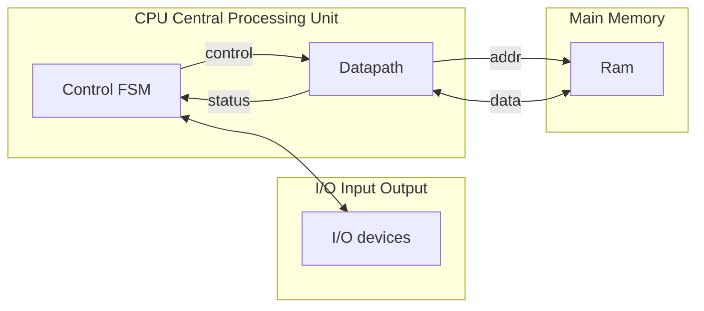
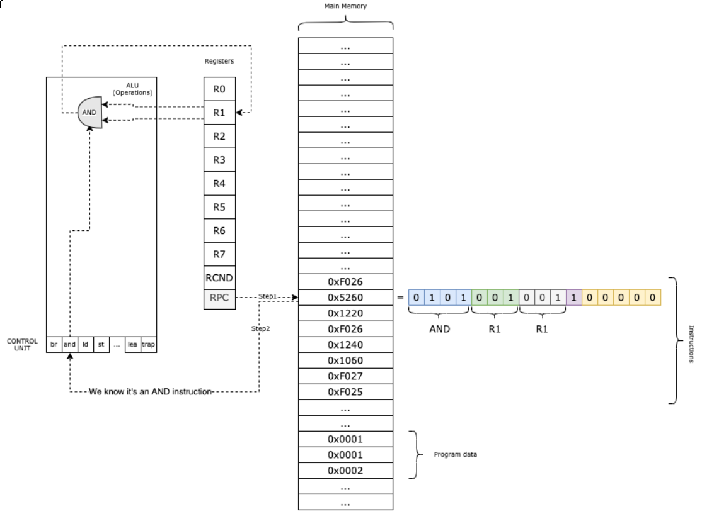

# Objectives

In this assignment we will be writing portions of a LC-3 ISA simulator
in C.  This assignment implements (most) of the 16-bit LC-3 architecture
as C functions.  These functions parallel what a typical microcode
level implementation would need to do to support the LC-3 ISA
in hardware.  By doing this assignments, you should get a better
grasp on how microarchitectures work to implement a target
ISA.  You will also practice some lower level C programming
skills (bitwise operators, hexadecimal notation, pointers
and pointer functions, C macros) that are useful to utilize
when writing implementations targeted at this level of operation
of a computing machine.  In addition, you will become even
more familiar with the 16-bit LC-3 instruction set
architecture (ISA) as we will implement the fetch-decode-execute
cycle to simulate most all of this machine architecture in
this assignment.

**Questions**

- What operations are needed by the microarchitecture to fetch and
  interpret LC-3 encoded machine instructions?
- How can we interpret machine language encoded instructions
  efficiently.
- What operations would a microarchitecture implementation of the
  LC-3 architecture need to implement (as circuitry/control store)
  to run LC-3 programs.
- How are C bitwise operators used to efficiently simulate the
  extraction and processing of 16-bit encoded instructions.
- How can we use C pointer functions to efficiently implement
  a ISA operator lookup table (similar to a control store lookup).

**Objectives**

- Become more familiar with the LC-3 ISA definition.
- Understand some of the tasks involved in an efficient
  microarchitecture implementation of an ISA.
- Have a working simulator of LC-3 machine language programs
  to use for this class.
- Learn about system level C functions useful in implementing
  procedures at this level of a machine description.


# Description

In this assignment you will be implementing a set of C functions and
macros to finish the implementation of a LC-3 ISA simulator/VM.  This
simulator, once finished, will be capable of taking (a subset of)
correctly assembled LC-3 machine instructions, and simulating their
execution.  By the end of this assignment you will have a working
register-based microarchitecture simulation capable of interpreting
and running most of the LC-3 instructions.  The code will be written
using basic C (C17/C18 standard compiler).

We will introduce/review C programming in class, concentrating on
talking about some of the features you will need for this assignment.
In particular, because of the level of the simulation we are implementing,
being very comfortable with using hexadecimal notation and the C
bitwise and shift operators will be useful for this assignment.  In
addition, you will need to understand/review using pointers in C.  We
will also be making use of function pointers, a topic not often covered
in programming classes that use C.  We will introduce these in our
class discussion and be using them to implement a type of look up
table of the LC-3 operations, similar to the control store of a
microarchitecture.

In this assignment, we will develop a simple type of microprogram designed
to execute programs written using the
[LC-3 Computer Architecture](https://en.wikipedia.org/wiki/Little_Computer_3).
The simulator will be capable of interpreting and executing (a subset
of) LC-3 machine instruction.  In this assignment we will leave out some
features from the full LC-3 architecture.  We will not implement
interrupt processing, priority levels, processes, status registers,
privilege modes, or supervisor/user stacks.  These are mostly all
mechanisms that are necessary for the operating system level of
operation of a computing system, and we will discuss those later on
in the course.  We will implement a few `traps` so that we can
simulate LC-3 programs that do I/O on the terminal.

Lets review a bit the basic concepts you should have at this point in the
course in order to implement the LC-3 simulation for this assignment.  The
LC-3 architectures is based on the stored-program 
( [von Neumann architecture](https://en.wikipedia.org/wiki/Von_Neumann_architecture) )
computer model. Such a stored-program computer has 3 basic components,
the **CPU** or processor, a **Main Memory** (RAM) and **input/output devices** (I/O).
These components are connected using various interconnects or busses in
a standard computing device.



The **CPU** is the digital logic circuitry that controls and manipulates data.  The
CPU is divided into three modules: **ALU**, **CU**, **Datapath**.

The ALU or arithmetic logic unit is used by the control unit and datapath to
perform calculations, moving data in and out of registers.

The CU or control unit controls the microarchitecture/microprogram implementing
the machines ISA.  Most control stores implement a type of finite state
machine (FSM) hardcoded as digital circuitry or in ROM.

The Datapath contains the storage registers.  These are quickly
accessible slots located in the CPU.  For LC-3 these include the 8
general registers `R0` through `R7` as well as special registers such as
the program counter `PC` and status bits `N`, `Z`, `P`.  The control unit
basically loads the next instruction from main memory and decodes and
interprets this instruction.  The execution of the instruction
typically involves loading data from memory into a register,
performing some change, and putting the changed data back into memory.

The **Main Memory** is really just an array of addressable words.  
Each memory word contains either one instruction or data encoded as
either an ascii character or a twos-complement encoded signed integer.
In the LC-3 architecture, there are 16 bit addresses, giving up to
$2^{16}$ or 64 Kw (kilowords) of addressable memory.  However each
"word" in LC-3 is also 16 bits, unlike typical computer memories, so
the amount of code/data addressable is actually twice as big as a
typical 64 Kb addressable memory.

The **Input/Output** devices enable communication with the outside
world.  In our LC-3 simulator, we will use `trap` system calls to
transfer data in/out of the simulated computer (by hooking into
standard C I/O functions).

# Overview and Setup

For this assignment you will be implementing missing member functions
of the `lc3vm.cpp` simulation.  As usual
before starting the assignment tasks proper, you should make
sure that you have completed the following setup steps:

1. Accept the assignment and copy the assignment repository on GitHub
   using the provided assignment invitation link for 'Assignment 03
   LC-3 VM/Microcode Simulator' for our current class semester and
   section.
2. Clone the repository using the SSH URL to your host file system
   in VSCode.  Open up this folder in a Development Container to access
   and use the build system and development tools.
4. Confirm that the project builds and runs, though no tests will be
   defined or run initially.  If the project does not build on the first
   checkout, please inform the instructor.  Confirm that you C/C++
   Intellisense extension is working, and that your code is being
   formatted according to class style standards when files are saved.
5. You should create the issue for Task 1 and/or for all tasks for the assignment
   now before beginning the first task.  On your GitHub account, go to `Issues`,
   and create them from the issue templates for the assignment.  Also make
   sure you are linking each issue you create with the `Feedback`
   pull request for the assignment.

# Assignment Tasks

The LC-3 microprogram/VM will function in the following manner.  We won't
quite go down to an ALU control signal level here, but we will be implementing
the basic fetch-decode-execute cycle and controlling the registers/datapath
based on fetched LC-3 instructions.  The basic outline of the simulator functions
like this:

- We load 1 LC-3 machine language (binary) program into the (simulated) main
  memory.
- In the RPC register, we keep the program counter, the next instructions to fetch,
  decode and execute.
- The instruction is fetched and the **Operation Code** (first 4 bits) is obtained
  from this instruction.  Based on that, we decode the rest of the address and
  control bits from the fetched instruction.
- We execute the method associated with the given instruction, using a function lookup
  table.
- We increment the RPC for normal sequential execution and continue with the next
  fetch-decode-execute cycle.



## Task 1: Defining and Accessing Memory

The LC-3 architecture has $W = 2^{16}$ or 64 kilo-words of memory, and each word
is size $N = 16$ bits.  There is a constant defined in the `<stdint.h>` C library
file named `UINT16_MAX` which is equivalent `UINT16_MAX` $= W = 2^{16} = 65535$.
Likewise there is a type defined that holds an unsigned integer 16 bit value
named `uint16_t`.  All addresses in our LC-3 architecture are 16 bit values that
we can interpret as unsigned 16 bit integers, thus this type will be the one
we use to hold all addresses and data in your LC-3 microarchitecture.

Also by convention, programs in LC-3 are often loaded into memory starting
at 0x3000 onwards.  Memory below 0x3000 may be reserved for the operating system
or other potential components.

If you look in the declarations for `lc3vm.c` an array is defined that will be
used to hold our memory for the simulation, as well as a constant value for the
conventional PC address to start executing from:

```C
uint16_t mem[UINT16_MAX + 1] = {0};
uint16_t PC_START = 0x3000;
```

In our first task we want to write two convenience functions that will be used
by the simulator to simulate the initiation of read and write operations to/from
main memory.  The `mem_read()` function simply takes an address and it returns the
value found at that memory address (as an `uint16_t` type).  Similarly the
`mem_write()` function takes both an address and a value and writes that value
into the indicated memory address.   Add the `mem_read()` and `mem_write()`
functions to the simulator.  You need to add a declaration/prototype for these
function into `lc3vm.h` and the actual implementation into `lc3vm.c`.  These
functions should both be very simple one lines of code, to either store a given
value into memory, or to read it out and return it.

You should then `#define` the `task1` tests in the `assg03-tests.cpp` to
enable the tests of `mem_read()` and `mem_write()`.  Running these unit tests will check that your memory read and write functions work as expected before moving
on.

Also it is worth mentioning that the registers have also been defined.  You will
find the following enumerated type and additional array defined in
`lc3vm.h` and `lc3vm.c`:

```C
enum registr { R0 = 0, R1, R2, R3, R4, R5, R6, R7, RPC, RCND, RCNT };
uint16_t reg[RCNT] = {0};
```

The enumerated type defines a set of constant names, R0 through R7 and then
registers for the program counter (RPC) and the condition codes (RCND).
These symbolic names are assigned an integer value/index starting at 0,
so the RCNT (register count) will be 10, which is the size of the array
of registers that we want to allocate.  You will use the `reg` array
and the register names to access registers directly, for example:

```C
reg[R3] = 0xbeef;
```

Once you have these functions working and passing the tests, you should
create a commit and push your work to your assignment repository in order
to finish this task.

## Task 2: Sign Extension Function

We will need to write a function (not a macro) to perform the sign
extension for the required number of bits.  Call this function
`sign_extend()` for sign extend.  This function takes an `unint16_t`
value which will be the low order bits that need to be extended.  And
a second value of type `int` which will be the size or number of bits
of the 2s complement number we have (call these parameters `bits` and `size` respectively).
The purpose of the function will be to extend the bit in the sign
position to all of the bits above it.  So if the size is a 5,
and we are given bits 0...10101, then the 1 at bit position 4 needs to be
extended to all higher bit positions 5-15 of the 16 bit 2's complement representation.  This
function thus returns a `uint16_t` result, which is the `bits` after
extending the sign bit correctly.  **NOTE**: We are passing in 5 which
means we have a 5 bit 2's compliment number, but the bit positions are
numbered 0-4, so the bit at bit position 4 is the sign bit, which needs
to be extended to bit positions 5-15.

You can implement the `sign_extend()` function like this.  You will need
to use bit manipulation here, including right shift `>>` left shift `<<`
bitwise and with a mask `&` and bitwise or with a mask `|`.  If the
bit at the sign position is a 1, then you need to shift a set of all 1
bits (0xFFFF) left by the `size`.  This will shift in 0's to the
bits from position 0 up to the `size`.  Then you need to perform
a bitwise or `|` of the original bits with this prepared mask.  Any bit that
was a 1 in the original bits will get set now for the low order bits, and all of the
high order bits will be 1 from your shift.

Likewise if the sign bit to extend is a 0, you should not assume all higher
bits are cleared.  So for example you could right shift a set of all 1 bits
(0xFFFF) right by `16 - size`, the purpose is to have a mask with all 0's
in the bits that need to be cleared, and 1's as a mask.  You can then bitwise
and this mask to clear the high order bits and thus sign extend the 0 to
all high order bits.

**NOTE**: This function does not assume that the the higher bits above the
number of bits being extended have been cleared or set.  So whether sign
extending a negative using 1's or a positive using 0's, in both cases you have
to correctly extend the sign bit up to the higher bit positions.

Once you have implemented your `sign_extend()` function, you should be able to
pass the test cases in task 2 testing this new function.  When you are
satisfied, make sure you make a commit and push it to your GitHub
classroom repository for grading.

## Task 3: Instruction / Operand Extraction Support Preprocessor Macros

As we have seen when looking at the LC-3 architecture, instructions have
a regular pattern.  Instructions have the same word size as memory, 16 bits.
So an instruction will be represented using the `uint16_t` type in our
simulation.

The LC-3 architecture supports only a limited set of instructions.  The first
4 bits of every instruction indicate the opcode, thus there are at most
$2^4 = 16$ possible instructions, of which all but 1 rare defined
as opcodes in LC-3.  The remaining 12 bits of each instruction provide 
parameters, using various addressing modes, for the operation.
Based on the opcode, we can identify the instruction and understand how to
"decode"/"extract" the rest of the parameters from the `uint16_t`.  In
an actual microcode architecture, these decoding steps of parameters would
be handled as a sequence of ALU operations.

We will use C `#define` preprocessor macros to perform a lot of the low level
bit extractions in this simulation. And some of your macros will reuse the
`sign_extend()` function from the previous task when we need to get
a value that will be interpreted as a 2's complement number.

### Macro to extract the opcode instruction

To start with, we need a macro that will shift an instruction right 12 bits, so that we end up
with only the 4 bit opcode remaining.  The default right shift operator
in C `>>` performs a logical shift, which shifts 0 into the high
order bits as it shifts down bits in the operation.  We will give you
this first opcode extraction macro as an example, you will be required
to perform the remaining extraction macros from the description.
So for example, to extract the opcode, we shift an instruction right by
12 bits.

```C
#define OPC(i) ((i)>>12)
```

The parenthesis around `i` and the whole operation are necessary to ensure that
when this macro is expanded, we don't get unintended consequences because of
operator precedence rules.  Add the shown macro to `lc3vm.h` and enable the
task3 tests.  If this extraction operation is working, you should find that
the task3 tests for the `OPC` operation are passing.

### Macros to extract source and destination registers

Given this same idea, we will now define some macros to extract the
destination register, which in many instruction is in bit positions 11-9, source
register 1 which is in often in bit positions 8-6, and source register 2
in bit positions 2-0.

Start with the source register 2.  Define a macro called `SR2`.  Source register 2 is in the last 3 bits of an instruction, bits 2-0.  So we don't need to shit these bits, we want the 3
register bits to end up in the 3 least significant bits, and 0's for all higher bits.  So
for this macro, we need to perform a bitwis and `&` operation.  Using a mask of 
`0x07` should cause all bits except the bottom 3 to become 0.

Then define a `SR1` macro.  Source register 1 is in bits 8-6.  So you first need to shift
right 6 positions.  But the bits above 8 in the original instruction contain the opcode and
destination registers.  So like  you did for `SR2`, once shifted down you have to ensure
all bits above the bottom 3 are 0 by using a mask.

Finally create a macro called `DR` to isolate the destination register.  The destination
register is in bits 11-9.  So first shift the bits right 9 positions.  And then like the
previous instructions, you need to mask after the shift to ensure only the 3 bits
of the destination register remain.

These 3 macros are tested in the next 3 test cases for task3.  See that all of those
tests are passing before continuing on.

### Macros to extract immediate and offset values

The next set of macros are intended to handle the immediate and offset operands 
given in many of the instructions.  These include the `imm5` 5 bits of immediate
value, and `PCoffset9`, `PCoffset11` and `offset6`, which are all values offset from
either the `PC` or some base register.  In all cases these are the last
(least significant) bits in the instruction, though of width 5, 6, 9 and 11 bits.
But also, these all need to be interpreted as twos-complement numbers,
so that when we use them as values or offsets, we can specify negative values or
offsets using a twos-complement encoding.  The issue is that, in order to
properly interpret these values as twos-complement, we can't simply AND the
needed bits with a mask.  The result will have 0's in all of the high order bits.
But if this is a negative number, we instead have to perform a sign extension
function.

Whatever the most significant bit is after masking, it needs to be shifted into
all of the higher order bits.  So you will reuse your `sign_extend()` function here.
If it is working properly, it already does the work to correctly mask out the
needed bits (based on the size), and extend either 0 or 1 as needed to extend
the 2s complement representation to the full 16 bits.

Create macros called `SEXTIMM`, `OFF6`, `PCOFF9` and `PCOFF11`. These macros will all
be similar.  All of them should expand to call your `sign_extend()` function on the
given macro value `i`.  The only difference is that the `SEXTIMM` Should extend
using a size of 5 bits for the 2's complement number.  Likewise, `OFF6` extends a
6 bit 2's complement and `PCOFF9` and `PCOFF11` will extend 9 and 11 bit 2's complement
sized bit patterns.

We will add a few more operand extraction functions as needed in later tasks,
but those are all we will do for Task 3.  Once you have these function/macros
implemented and passing the tests, make a commit and push your work to your
GitHub classroom repository.

## Task 4: PZN Condition Flags

In addition to extracting register addresses and offset values, we will need
to maintain the condition flags for the LC-3 machine.  Recall that on most all
operations that modify a register, the NZP condition flags will be updated to
reflect if the last operation resulted in a negative result, zero result or positive
result (where negative or positive are interpreted to mean that the number is
a twos-complement number and result was either negative with a 1 in the sign
bit or positive with a 0 in the sign bit).

If you look in the `lc3vm.h` file you will see that flags for these condition
codes have been defined like this:

```C
enum registr { R0 = 0, R1, R2, R3, R4, R5, R6, R7, RPC, RCND, RCNT };
enum flags { FP = 1 << 0, FZ = 1 << 1, FN = 1 << 2 };
```

We will be using the register named `RCOND` to *hold* the condition codes.
We are actually only going to be using the least 3 significant bits of
this register.  But for example we can set the `Z` zero flag condition in 
this register simply by assigning the flag to our condition codes register:

```C
reg[RCND] = FZ;
```

Only 1 condition, negative, zero or positive can ever be true as the result of
an operation that modifies a register.

For the task 4, we will create another function named `update_flags()`.
This function takes a `enum registr` as its input parameter, which is the
register that was just modified by an instruction that we have to set the
condition flags based on.  For example, our microcode might do the following

```C
update_flags(R2);
```

to update the condition codes based on the current result stored in the `R2`
register.  This function does not return any result, so it is a `void`
function.  It works by the side effect of changing the `RCND` register to be
either `FN`, `FZ` or `FP` depending on if the updated register is currently
negative, zero or positive.  To implement this function, you have to test
the value in the given register.  If it is 0 then the condition register needs
to be set to `FZ`.  If not 0, you have to determine if the value in the register
is negative or positive by interpreting the 16 bits as a signed twos-complement
number.  So if the most significant bit is a 1, then the current result is 
negative, and you need to set `FN`, but if the most significant bit is a 0 then
the result is positive, and you should set `FP`.

Define the task3 unit tests and implement `update_flags()` as described.  Once
the tests are passing for task3, you should commit and push your work to your
assignment repository before moving on to the next task.

## Task 5: Implement LC-3 Arithmetic/Logic Microcode Operations

We will next implement the microcode for the LC-3 operations as functions.  These
functions will use the functions and macros from your previous tasks (and add some additional ones) to implement
the microcode steps needed to perform each LC-3 operation.  We can broadly break
up the LC-3 operations into 4 categories:

1. `add`, `and`, `not` are performing **arithmetic / logic operations** on the data kept in the registers.
2. `ld`, `ldr`, `ldi`, `lea` are used to **load data** from main memory to the registers.
3. `st`, `str`, `sti` are used to **store data** from registers back to main memory.
4. `br`, `jmp`, `jsr` are used to effect the **flow of control** of our programs, jumping from one instruction to another, or conditionally jumping (rather than the default sequential execution).

Here is a summary of the LC-3 opcode specification we will be implementing

| **Instruction** | **OpCode** Hex | **OpCode** Bin | **C function**         | **Comments**                            |
|-----------------|----------------|----------------|------------------------|-----------------------------------------|
| `br`            | 0x0            | 0b0000         | void br(uint16_t i)    | Conditional branch                      |
| `add`           | 0x1            | 0b0001         | void add(uint16_t i)   | Used for addition                       |
| `ld`            | 0x2            | 0b0010         | void ld(uint16_t i)    | Load RPC + offset                       |
| `st`            | 0x3            | 0b0011         | void st(uint16_t i)    | Store                                   |
| `jsr`           | 0x4            | 0b0100         | void jsr(uint16_t i)   | Jump to subroutine                      |
| `andlc`         | 0x5            | 0b0101         | void andlc(uint16_t i) | Bitwise logical AND (c++ keyword)       |
| `ldr`           | 0x6            | 0b0110         | void ldr(uint16_t i)   | Load Base + Offset                      |
| `str`           | 0x7            | 0b0111         | void str(uint16_t i)   | Store Base + Offset                     |
| `rti`           | 0x8            | 0b1000         | void rti(uint16_t i)   | Return from interrupt (not implemented) |
| `notlc`         | 0x9            | 0b1001         | void notlc(uint16_t i) | Bitwise complement  (c++ keyword)       |
| `ldi`           | 0xA            | 0b1010         | void ldi(uint16_t i)   | Load indirect                           |
| `sti`           | 0xB            | 0b1011         | void sti(uint16_t i)   | Store indirect                          |
| `jmp`           | 0xC            | 0b1100         | void jmp(uint16_t i)   | Jump/Return to subroutine               |
|                 | 0xD            | 0b1101         |                        | Unused OpCode                           |
| `lea`           | 0xE            | 0b1110         | void lea(uint16_t i)   | Load effective address                  |
| `trap`          | 0xF            | 0b1111         | void trap(uint16_t i)  | System trap/call                        |

We will start in this task with the mathematical / logic operators `add`, `andlc`, `notlc`.  Because we are using
a C++ testing framework, we have some keyword conflicts using `and` and `not` keywords, thus we
give slightly modified function names for those opcodes in this assignments.

### add - Adding two values

If you look back at the LC-3 specification, there are two versions of
the `add` operation.  One takes a destination register and two source
registers, adds the values in the two source registers, and puts the
result into the destination register (updating flags based on this new
value in the destination register).  The second version uses one
source register and interprets the low 5 bits as an immediate
twos-complement signed value.

Which version that is used depends on the bit at position 5.  There is
a macro already defined for you, called `FIMM` which tests the "flag" at
bit 5 that determines if an immediate value or another register is
present (the `and` operator works the same way).

Add a function named `add()` that has the signature shown in the table
above.  All of our microcode functions will take the full instruction
as a parameter (so we can extract the correct operands), and will be
void functions that do not return a result, but that may update
register values and the condition flags as a side effect, like this
function does.

To implement `add` first test if `FIMM` is 1.  If it is then 
the immediate value version of `add` is being performed.  You would
need to use the `SEXTIMM()` macro which uses your `sign_extend` function
to extract the second operand. And you would also need to use the `SR1`
macro to extract the source register number.  The value in the source register
needs to be looked up from the `reg[]` array, which contains the current values
of the eight registers `R0` - `R7`.  

 If `FIMM` is a 0 then there are two source registers for operands.  So you
 would use your `SR1` and `SR2` macros to extract the source register number
 of the two operands from the `reg[]` array.

In both cases, we can cheat a little bit and simply use the C language
`+` addition operator to perform the addition (this would end up enabling an adder
circuit in a real computer hardware architecture).  Even though the parameters
and registers are declared as `uint16_t` unsigned 16 bit types, the addition
will still work and get the expected result, even if we are interpreting
the bits as signed twos-complement numbers.  The only issue is that the result
might actually no longer fit into the 16 bit representation.  In some
architectures, this overflow would be detected and a condition code would
be set to indicate overflow, but we do not handle that for the LC-3 machine.

The result of the addition should be saved in the destination register, so
you will need to use the `DR` macro and assignment the result from the
operation back into the indicated destination register.

Also the `add` operation will cause the condition code flags to update.  So you
need to call your `update_flags()` function on the destination register after
performing the operation.

### and - Bitwise logical AND of two values

Once you have the `add` working, implement the `andlc`.  The logical
AND operation has exactly the same two modes as the `add` operator.  So
the code will be identical, except you will need to perform a logical bitwise and
operation using the C `&` operator, rather than addition.  Also if an 
immediate value is used, it is sign extended just like for `add` for consistency
and because that makes it possible to and immediate values with 1's in the
higher bits if needed.

### not - Bitwise logical NOT of a value

Finally for this task implement the `notlc` operator.  The logical NOT
is simpler than `add` and `andlc`.  It only has a source register and a 
destination register.  Use the C not operator `~` to perform the operation,
and again don't forget to update the condition code flags based on the
result of this operation.

Once you have implemented these three operations and are passing the task4
tests, commit your work and push it to your assignment repository.

**NOTE**: These functions were named `andlc` and `notlc` because we are using a C++ framework for
testing, and `and` and `not` are a keywords in C++. So to avoid errors when using keywords
as names, we had to choose a slightly different name for these microcode functions.

## Task 6: Load Data from Memory Operations

There are 4 operations to transfer data from memory to a register, though as
you should know the `lea` actually only calculates an address that might
be useful to load data from, but doesn't actually perform a memory transfer.
So for `ld` load, `ldi` load indirect and `ldr` load relative offset to a base,
all three of these will use the `mem_read()` function you implemented previously.

### ld - Load RPC + offset

The basic `ld` instruction calculates an address that is an offset from the
current `RPC` and transfers the data it finds in that address into a destination
register.  Uncomment the task5 tests and start with the `ld` instruction.  

To implement this function you have to perform the following steps:

1. You need to calculate the address in memory to load.  The low 9 bits are a
   pcoffset, so you need to use your `PCOFF9()` macro to extract those, and add that
   to the current value of the `RPC` program counter register.
2. The address you calculated by adding some offset to the program counter is the location
   in memory to read from, so you will need to use your `mem_read()` function.
3. The value that is read from memory should be stored in the indicated destination
   register for this instruction, so you need your `DR` macro to save the value into
   the correct `reg[]`.

Don't forget also that for `ld` the status flags should be updated by the value
that is loaded into the destination register, so you will again be calling
the `update_flags()` at the end of this function.

### ldi - Load indirect

This function has the same form as `ld`.  And it will start off exactly the same.
However, the first value that you read from memory will instead be treated as an
address.  That address is what you ultimately need to read a value from and store
into the destination register.  Thus you will implement this function
by calling `mem_read()` two times.  Don't forget again that whatever value
is ultimately fetched, the status flags need to be updated using this value that
was indirectly loaded into the destination register.

### ldr - Load using Base register + offset from Base

This instruction uses an address in a base register (which is in same bits
we called `SR1` so you can use that macro to get the base register) and adds
an offset specified by the low 6 bits.  So you need to 

1. Get the base register address using the `SR1` macro, and add in the offset 6 bits
   using your `OFF6` macro to calculate the target address.
2. Read this value from memory using your `mem_read()` function.
3. Store this value into the destination register indicated by the `DR` macro.

As with the other loads the status flags will also be updated using whatever value is
fetched into the destination register here.

### lea - Load Effective Address

This function really is a helper that calculates potentially useful addresses
and gets those addresses loaded into a register.  So for example we might use
`lea` to calculate a base address, and then use `ldr` to fetch data at some
offset from that base register.  So `lea` is simply implemented by adding
the pc9 offset bits to the current `RPC` and saving this calculated address into
the destination register (no memory read is performed by this address).

Unlike the other load functions, the status flags are not effected by
a value being calculated and put into a register by `lea`, so you will not
be calling `update_flags()` for this function.

Once you have completed the loading functions and are passing the tests for
task 5, make a commit and push your work to your GitHub classroom repository.

## Task 7: Store Data to Memory Operations

There are 3 operations that transfer a value from a register back to 
main memory.  These are the basic store to offset from PC `st`, the
store with an indirect reference `sti` and the store relative to a base
register address + offset `str`.  All of these have the same operation
decoding as the corresponding load functions, except the DR is really
a source register, the value in the source is what is saved to
memory (but you can continue using the `DR` macro).  Likewise for all 3
of these function, you will need to use the `mem_write()` function to
write the source value into the indicated memory location.

### st - Store to PC + offset

The `st` like the `ld` uses a `PCOFF9` low 9 bits to calculate
and address relative to the current `RPC`.  The value in the source
register (`DR`) is written to this location.

### sti - Store with indirect reference

As with the `ldi`, the `sti` works similar to the basic `st` but with an
extra level of indirection.  Therefore you will need to first use
a `mem_read()` here to get the initial address from memory, then use
the `mem_write()` to write the source register value to the indirectly
indicated address.

### str - Store to base + offset reference

Again the `str` parallels the `ldr`.  There is a base register and a 6 bit
`PCOFF9` in the instruction.  These values are combined to give an address.
The value in the source register is then written to this address.

None of the store routines cause the status flags to change, so you will not
be calling `update_flags()` for any of these routines.  Once you have
enabled and are passing all of the task7 tests, make a commit and push your
work to your github classroom repository.

## Task 8: Control Flow Operations

As you know, typically the `RPC` register for fetch-decode-execute
cycles will be auto-incremented when each instruction gets executed.
Thus the normal flow of control is to fetch and execute the next
instruction immediately after the current one being processed.

There are three operations in LC-3 that affect the flow of the
program control.  The `jmp` instruction performs a simple absolute
jump based on an address in a register.  The `br` instruction
allows for conditional branching based on the result
(`FN` negative, `FZ` zero, `FP` positive) of the last operation that
modified a register.  The `br` instruction uses a PCOFF9 9
bit offset from the current `RPC`, unlike the absolute jump which
jumps based on an already calculated address in a register.  So
as we discussed in class, a `br` is effectively limited to a
window of $\pm 255$ from the current `RPC`, while a `jmp`
allows for a long jump in memory.

Finally the LC-3 architecture supports the notion of
subroutines (basically same idea as functions). 

### jmp - Unconditional Jump to Address

The `jmp` instruction specifies a register with an
address.  This address is placed into the `RPC` and the
next fetch will then come from this address.  For some
reason, bits 8-6 are used to specify the base register
holding the address to jump to.  This register is the
same location as our `SR1` source register 1 macro, so
we will reuse it to obtain the base register address.

Implement the `jmp` instruction as described and enable
the `task8` tests.  Once the tests are passing for 
the jump instruction, continue with the other control
flow instructions.

### br - Conditional Branch

The conditional branch is important as it is the only way
to implement loops and conditional statements at the
machine code level in LC-3.  The bits in 11-9 contain
settings that indicate if the branch should happen if the
last result was negative (bit 11) zero (bit 10) or 
positive (bit 9).  These bits correspond with the `DR`
macro you have already defined, and we can use that
macro to extract the given 3 bits.  But these bits need
to be compared with the bits in the `RCOND` register.  
Any, none or all of the N,Z,P bits can be set, which allows
for different kinds of conditional branches (or an
unconditional branch if all bits are 1).  

The target location of the branch uses the PCOFF9 9 low
order bits to calculate a new address relative to the
current `RPC` as we have done for other instructions.

To implement `br`, you need to check the instruction N,Z,P bits
against the current `RCOND` bits.  As mentioned, these are in the
same positions accessed by the `DR` macro, which you can reuse here
to extract from the instruction.  You have to and `&` together the
`RND` register and the condition bits in the instruction.  If the
result is true (non zero) then the flag specified in the instruction
and the condition code in RCOND must both have been set, so you should
perform the branch.  If the result end up being false (zero) then you
do nothing, the conditional branch is not taken.

Implement the `br` instruction and once it is passing
the unit tests continue on to the final control
flow statement.

### jsr - Jump to Subroutine

The basic jump to subroutine in LC-3 provides for a limited
ability to implement function calls and returns.  Basically
when a jump into a subroutine is performed, the current
`RPC` will be saved by the machine into the `R7` register.
The subroutine has to know it is a subroutine and not
modify this register.  If we want to support nested or
recursive subroutines, the routines are responsible for
maintaining the R7 register return address themselves.

There are really two versions of the jump to subroutine.
Bit 11 is used to indicate if it is a jump into a
subroutine `jsr`, or a return from the subroutine `jsrr`.
We have given you a `FL` macro which extract this bit so you can tell
if it is set so a `jsr` should be performed, or unset, in which case
we do a `jsrr`.

The pseudo-code for the operation is as follows:

1. We save the `RPC` in `R7` (to *remember* from where we jumped).
2. If `bit[11]` (use `FL` macro) is set to 0 this is a return, so we set `RPC = BASER`
   which will be found in bits 8-6, the `SR1` bits.
3. else if `bit[11]` is set to 1 this is a jump to another subroutine, so
   we set `RPC = RPC + OFFSET11`.  The low 11 bits can be used as an
   offset here, so you will use your macro `PCOFF11` to extract these.

The reason that the `RPC` is saved in `R7` but the return specifies
the register to use to get the next `RPC` is that subroutines can use
this to manage registers and return addresses.  Notice that this
function always saves the `RPC`, even for returns.  So for a return,
if the return address is in R7, we need to first move it to another
register, then call `jsrr` with this register.  Likewise if a
subroutine wants to call another subroutine, it needs to save the
return address first somewhere.  Then when it is ready to return it
can specify the location it moved the return address to `jsrr`.

Implement the flow control instructions and get the `task8` tests
passing.  Once you have completed the instructions and you
are satisfied with your tests, make a commit and push your
work to your classroom GitHub repository.

## Task 9: Trap instruction

The trap instructions have been given to you, there is nothing to be
implemented in this section.  But do read the following description of
what the trap instruction does, and enable the task 8 tests and
understand how they work in this simulator.

The trap instruction is more complex because it enables us to interact
with the system I/O and theoretically other devices.  In essence this
is a hook in the ISA that allows the operating system to set up
special routines for a user to get access to I/O devices
and I/O routines.

The `trap` instruction takes a single 8 bit `TRAPVECT`.  There is a macro
already defined that extracts the low 8 bits to determine which trap
vector was invoked.  The trap vector is simply an 8 bit number or code
that in theory the operating system can use to loop up or direct
operation to the routine that services that trap.

In the example implementation in this simulator, each trap will be kept in an
array `trap_ex` that contains pointers to the associated
C functions.  You will use this same strategy to implement the
fetch-decode-execute main simulation loop, but we keep a separate array
here of function pointers for the trap instructions.  In a real system, the
trap service routines would need to be implemented in LC-3 assembly, but here
since we are in a simulator, we hook into the c standard library to implement
most of the available I/O (keyboard and console) for the simulator.

The following table lists the trap routines implemented for this
simulation.  The trap vector number is defined in the LC-3 standard,
since they all start at 0x20, we can subtract this to index into the
`trap_ex` function pointer lookup table.

| **Routine** | **TRAPVECT** | **index** | **Comments**                                                      |
|-------------|--------------|-----------|-------------------------------------------------------------------|
| tgetc       | 0x20         | 0         | Reads a character (char) from keyboard and copies to `R0`         |
| tout        | 0x21         | 1         | Writes the character (char) from `R0` to the console              |
| tputs       | 0x22         | 2         | Writes a string of characters to the console. As a rule, the      |
|             |              |           | characters are kept in a contiguous memory location, one char     |
|             |              |           | per memory location, starting with the address specified in `R0`. |
|             |              |           | If 0x0000 is encountered, printing stops.                         |
| tin         | 0x23         | 3         | Reads a character (char) from the keyboard, and gets copied       |
|             |              |           | in `R0`.  Afterward, the char is printed on the console.          |
| tputsp      | 0x24         | 4         | Not implemented.  This trap is used to store 2 characters per     |
|             |              |           | memory location instead of 1.  Otherwise it works like tputs.     |
| thalt       | 0x25         | 5         | Halts execution of the program.  The VM stops.                    |
| tinu16      | 0x26         | 6         | Reads a `uint16_t` from the keyboard and stores it in R0.         |
| toutu16     | 0x27         | 7         | Writes the `uint16_t` found inside R0 to the console.             |

## Task 10: Control Store and Fetch-Decode-Execute Loop

Congratulations, if you have proceeded this far you basically have all of the
pieces to implement a functional LC-3 simulator.  The only remaining bit is
to define the `main` microcode starting point that defines the
fetch-decode-execute cycle for the simulator.

There is already a 

```C
bool running = true;
```

defined in `lc3vm.[hc]` that controls when the program should halt, and
`running` is set to `false` when a halt trap service routine is invoked.

We are going to use an array of function pointers here to simulate the
microcode lookup of instructions when they are decoded. There is an example
of such an array given for the trap service routines that you can follow.

For the opcode function lookup table, there is already a typdef defined in
`lc3vm.h`:

```C
#define NUMOPS (16)
typedef void (*op_ex_f)(uint16_t i);
```

This means that an opcode execution function has a signature that takes
a single `uint16_t` parameter as input (the instruction to execute),
and it is a void function.  The parameter is the instruction that needs
further decoding in the opcode execution function.

Create an array of `op_ex_f` pointers (see the trap lookup array for an
example). This array should be defined below the trap function in your
`lc3vm.c` source file. This array can hold up to 16 opcode execution functions 
(use NUMOPS for the array size).  Add in all of the opcode
execute functions to this array, being careful that you add them in
the correct order.  For example, `br` has opcode b0000 so it should be at
index 0 of this table in order to be invoked correctly.  All 16
functions (including the `res` function for the reserved/unused opcode),
need to be placed in correct order in this lookup table.

Then implement the `start()` function to execute the main
fetch-decode-execute loop for our LC-3 simulation.  Ths function should
take an `uing16_t` parameter named `offset` as input.  Normal execution
is to start the RPC at `PC_START` 0x3000.  The offset should be added to
the `PC_START` and assigned to the `reg[RPC]` before starting the main
fetch-decode-execute loop.  So for example, if an offset of 0 is specified,
programs start fetching and executing from the default `PC_START`
location 0x3000.

After initializing the `RPC` write the main loop.  Use a `while` loop that
runs as long as `running` is `true`, and stops when `running` is set to `false`.
The basic steps in the main loop are:

- Fetch the next instruction.  Use `mem_read` to fetch an instruction
  from memory.  The instruction fetched is the one currently pointed to by
  the `reg[RPC]` register.
- Increment the `RPC` by 1 in preparation for the next fetch.  This needs
  to be done before calling the opcode execution function, as all PC
  relative addresses expect the `RPC` to already be incremented before
  calculating their offset location.
- Use the opcode lookup table to lookup and invoke the opcode
  instruction execution function.  You need the OPC(i) macro to extract the
  4 opcode bits here, and look up the routine in the table you created.
  Invoke the opcode function that is indicated, making sure to pass in the
  instruction for further decoding in the function.
  
In the tests for `task10` a single program is loaded and your `start()`
method is invoked.  This program does a few calculations and then calls
the halt trap service routine.  Some more tests of programs are done next
in the system tests for your assignment.
 
If your `start()` routine works and the `task10` tests pass, commit your work
and push it to your GitHub classroom repository.

# System Tests: Testing and Running the LC-3 Simulator

The system tests do the same thing that the `task9` unit test did, load a program
and invoke your `start()` method, then test expected results after the program
halts.  Several programs are loaded and tested.  

You will need to uncomment the code in the `assg03-sim.c` file that calls your
`start()` main simulation loop and recompile.  Once the call to your main loop
implementation is being invoked, you should be able to run simulations by hand
and run all of the system tests.

You can run the system tests by opening a terminal and doing a

```
$ make system-tests
```

Which will invoke a script that loads several test programs, executes them and then
checks their results.  If all of your system tests are passing, you will be
awarded the final 5 points for the assignment in your GitHub classroom autograder.

You can run an individual LC-3 simulation like this:

```
$ ./sim progs/sum.obj
```

# Assignment Submission

For this class, the submission process is to correctly create pull
request(s) with changes committed and pushed to your copied repository
for grading and evaluation.  For the assignments, you may not be able
to complete all tasks and have all of the tests successfully
finishing.  This is ok.  However, you should endeavor to have as many
of the tasks completed before the deadline for the assignment as
possible.  Also, try and make sure that you only push commits that are
building and able to run the tests.  You may loose points for pushing
a broken build, especially if the last build you submit is not
properly compiling and running the tests.


In this problem, up to 50 points will be given for having at least 1
commit that compiles and runs the tests (and at least some attempt was
made to work on the first task).  Thereafter 5 to 10 points are awarded for
completing each of the remaining 6tasks.  However you should note that the
autograder awards either all point for passing all tests, or no points
if any test is failing for one of the tasks.  Also note that even if
you pass all tests, when the instructor evaluates your assignment,
they may remove points if you don't follow the requirements for
implementing the code (e.g. must reuse functions here as described,
need to correctly declare parameters or member functions as `const`
where needed, must have function documentation correct).  You may also
loose points for style issues.  The instructor may give back comments
in pull requests and/or create new issues for you if you have issues
such as these, so it is good to have work committed early before the
due date, so that the instructor may give feedback requesting you to
fix issues with your current submission.


# Requirements and Grading Rubrics

## Program Execution, Output and Functional Requirements

1. Your program must compile, run and produce some sort of output to be
   graded.  0 if not satisfied.
2. 40 points for keeping code that compiles and runs.  A minimum of 50 points
   will be given if at least the first task is completed and passing tests.
3. 5 to 10 points are awarded for completing each subsequent task 2-10.
4. +5 bonus pts if all system tests pass and your process simulator produces
   correct output for the given system tests.

## Program Style and Documentation

This section is supplemental for the first assignment.  If you uses
the VS Code editor as described for this class, part of the
configuration is to automatically run the `clang-format` code style
checker/formatter on your code files every time you save the file.  You
can run this tool manually from the command line as follows:

```
$ make format
clang-format -i include/*.hpp src/*.cpp
```

Class style guidelines have been defined for this class.  The `uncrustify.cfg`
file defines a particular code style, like indentation, where to place
opening and closing braces, whitespace around operators, etc.  By running the
beautifier on your files it reformats your code to conform to the defined
class style guidelines.  The beautifier may not be able to fix all style
issues, so I might give comments to you about style issues to fix after looking
at your code.  But you should pay attention to the formatting of the code
style defined by this configuration file.

Another required element for class style is that code must be properly
documented.  Most importantly, all functions and class member functions
must have function documentation proceeding the function.  These have been
given to you for the first assignment, but you may need to provide these
for future assignment.  For example, the code documentation block for the first
function you write for this assignment looks like this:

```c++
/**
 * @brief initialize memory
 *
 * Initialize the contents of memory.  Allocate array larget enough to
 * hold memory contents for the program.  Record base and bounds
 * address for memory address translation.  This memory function
 * dynamically allocates enough memory to hold the addresses for the
 * indicated begin and end memory ranges.
 *
 * @param memoryBaseAddress The int value for the base or beginning
 *   address of the simulated memory address space for this
 *   simulation.
 * @param memoryBoundsAddress The int value for the bounding address,
 *   e.g. the maximum or upper valid address of the simulated memory
 *   address space for this simulation.
 *
 * @exception Throws SimulatorException if
 *   address space is invalid.  Currently we support only 4 digit
 *   opcodes XYYY, where the 3 digit YYY specifies a reference
 *   address.  Thus we can only address memory from 000 - 999
 *   given the limits of the expected opcode format.
 */
 ```
This is an example of a `doxygen` formatted code documentation comment.
The two `**` starting the block comment are required for `doxygen` to
recognize this as a documentation comment.  The `@brief`, `@param`,
`@exception` etc. tags are used by `doxygen` to build reference
documentation from your code.  You can build the documentation using the
`make docs` build target, though it does require you to have `doxygen`
tools installed on your system to work.

```
$ make refdocs
Generating doxygen documentation...
doxygen config/Doxyfile 2>&1 | grep -A 1 warning | egrep -v "assg.*\.md" | grep -v "Found unknown command" | grep -v "Searching for include" | sed -e "s|/home/dash/repos/assg01/||g"
Doxygen version used: 1.9.1
```

The result of this is two new subdirectories in your current directory named
`html` and `latex`.  You can use a regular browser to browse the html based
documentation in the `html` directory.  You will need `latex` tools installed
to build the `pdf` reference manual in the `latex` directory.

You can use the `make refdocs` to see if you are missing any required
function documentation or tags in your documentation.  For example, if you
remove one of the `@param` tags from the above function documentation, and
run the docs, you would see

```
$ make refdocs
doxygen config/Doxyfile 2>&1 | grep -A 1 warning | egrep -v "assg.*\.md" | grep -v "Found unknown command" | grep -v "Searching for include" | sed -e "s|/home/dash/repos/assg01/||g"

HypotheticalMachineSimulator.hpp:88: warning: The following parameter of
HypotheticalMachineSimulator::initializeMemory(int memoryBaseAddress,
    int memoryBoundsAddress) is not documented:
  parameter 'memoryBoundsAddress'

```

The documentation generator expects that there is a description, and that
all input parameters and return values are documented for all functions,
among other things.  You can run the documentation generation to see if you
are missing any required documentation in you project files.
